# 00_overview：芯片开发流程总览

## 前置知识

- 无。建议从本文件开始阅读。
- 如果你已经熟悉 ASIC 项目，可以直接读 [01_full_lifecycle.md](./01_full_lifecycle.md) 和 [03_cost_structure.md](./03_cost_structure.md)。

## 本目录的作用

本目录是整份 Wiki 的地图层。它不试图把每个环节讲成专家教程，而是先回答创始人最需要搞清楚的几个问题：一个芯片项目从想法到量产到底经过哪些阶段，每个阶段谁负责，钱花在哪里，创业公司和大公司流程差异在哪里，以及跨团队沟通时必须掌握哪些术语。

对软件背景创始人来说，最重要的认知转换是：芯片项目不是“写完代码、测试通过、上线迭代”的软件项目。芯片的许多错误会在 [流片](./05_glossary.md#流片-tapeout) 后变成真实硅片成本，修复周期以月计，修复费用可能以百万美元量级计。前端阶段看似只是“代码”，但它的输出会直接决定后端实现、功耗、时序收敛、测试覆盖率、良率和量产成本。

## 本目录文件索引

- [01_full_lifecycle.md](./01_full_lifecycle.md)：完整生命周期，从产品定义、架构、RTL、验证、后端、流片、硅后到量产。
- [02_roles_and_teams.md](./02_roles_and_teams.md)：各类工程角色、团队接口、创业早期招聘优先级。
- [03_cost_structure.md](./03_cost_structure.md)：[NRE](./05_glossary.md#nre)、[mask cost](./05_glossary.md#mask-cost)、晶圆、封装、测试、IP、EDA、人力成本。
- [04_startup_vs_bigcompany.md](./04_startup_vs_bigcompany.md)：创业公司与大公司在流程、决策、外包和风险承受上的差异。
- [05_glossary.md](./05_glossary.md)：术语表，作为全 Wiki 的交叉引用入口。

## 芯片开发总流程图

```mermaid
flowchart LR
  A[产品定义与商业假设] --> B[架构探索与规格冻结]
  B --> C[微架构与RTL设计]
  C --> D[功能验证与前端Signoff]
  D --> E[综合与DFT]
  E --> F[后端物理设计]
  F --> G[物理Signoff]
  G --> H[流片Tapeout]
  H --> I[晶圆制造]
  I --> J[封装与测试]
  J --> K[硅后Bring-up]
  K --> L[特性化与可靠性验证]
  L --> M[量产爬坡]
  M --> N[现场支持与生命周期管理]
```

## 推荐阅读方式

第一遍阅读建议按流程读完，不要卡在单个术语。你需要先知道“有哪些门”，再回头研究“每扇门怎么过”。

对 Biao 这种系统软件和 AI 芯片架构背景，推荐顺序是：

1. 先读 [01_full_lifecycle.md](./01_full_lifecycle.md)，建立端到端流程地图。
2. 再读 [02_roles_and_teams.md](./02_roles_and_teams.md)，知道每个环节需要什么人。
3. 接着读 [03_cost_structure.md](./03_cost_structure.md)，理解哪些决策会变成现金压力。
4. 然后读 [04_startup_vs_bigcompany.md](./04_startup_vs_bigcompany.md)，校准“快速迭代芯片公司”的现实边界。
5. 阅读其他目录时，遇到术语先跳到 [05_glossary.md](./05_glossary.md)。

## 本目录不会做什么

本目录不会教你怎么写 [UVM](./05_glossary.md#uvm) testbench、怎么跑 [STA](./05_glossary.md#sta)、怎么做 [Floorplan](./05_glossary.md#floorplan)、怎么调 [ATE](./05_glossary.md#ate) pattern，也不会替代资深后端、DFT、硅后或 foundry interface 的专业判断。它的任务是建立流程接口：上一阶段输出什么，下游如何消费，哪个决策点一旦错了会在后面放大成成本、周期或产品风险。

这种边界很重要。软件背景的人容易希望把所有知识压成一个可执行 playbook，但芯片工程很多信息受工艺、foundry、IP、EDA 版本、封装、客户认证和供应链影响。Wiki 的目标是让你能与专业工程师有效沟通、识别风险、配置资源，而不是让你在每个岗位上替代专家。

## 软件背景创始人的核心提醒

软件工程里，很多复杂度来自代码规模、团队协作、线上运维和用户需求变化。芯片工程里，复杂度还来自物理世界：时钟、复位、亚稳态、寄生参数、电压降、热、制程偏差、封装、测试覆盖率和供应链排期。

一个 [C Model](./05_glossary.md#c-model) 正确，不代表 [RTL](./05_glossary.md#rtl) 可综合；RTL 仿真正确，不代表后端能收敛；后端 [Signoff](./05_glossary.md#signoff) 通过，不代表首硅 [Bring-up](./05_glossary.md#bring-up) 顺利；样片能跑 demo，也不代表可以量产。

你的自动化和 AI Agent 策略最可能加速的是架构探索、规格一致性检查、RTL 模板化生成、验证用例生成、回归调度、报告归因和设计空间搜索。它最难绕开的是真实硅片制造、mask 制作、foundry 排期、封装产能、可靠性验证、客户导入周期和供应链资格认证。

## 典型场景

假设创业公司要做第一颗 AI 推理芯片，目标是数据中心边缘推理。团队先用 workload trace 定义算子、精度、带宽和功耗目标，架构团队写 C++/Python 模型，编译器团队做图优化和 kernel 映射，RTL 团队实现 NPU、DMA、NoC 和外设，验证团队搭建 [UVM](./05_glossary.md#uvm) 环境并用 C model 做 reference model。

当前端收敛后，设计进入 [Synthesis](./05_glossary.md#synthesis)、[DFT](./05_glossary.md#dft)、floorplan、placement、[CTS](./05_glossary.md#cts)、routing、STA、[IR Drop](./05_glossary.md#ir-drop)、DRC/LVS，最终生成 [GDSII](./05_glossary.md#gdsii)/OASIS 交给 [Foundry](./05_glossary.md#foundry)。数月后拿到封装样片，硅后团队做 bring-up、测试、性能特性化和 bug triage。如果 bug 是软件 workaround 可解决，继续推进客户评估；如果是硬件功能错误或时序/功耗灾难，可能需要 metal ECO 或 [Respin](./05_glossary.md#respin)。

这个场景里的关键点是：越早的决策越便宜，越晚的错误越昂贵。架构阶段省掉的验证、DFT、低功耗和可观测性，通常会在硅后以更高代价回来。

## 后续阅读

- [01_full_lifecycle.md](./01_full_lifecycle.md)
- [02_roles_and_teams.md](./02_roles_and_teams.md)
- [03_cost_structure.md](./03_cost_structure.md)
- [04_startup_vs_bigcompany.md](./04_startup_vs_bigcompany.md)
- [05_glossary.md](./05_glossary.md)

## 参考公开来源

- [Accellera UVM Working Group](https://www.accellera.org/activities/working-groups/uvm)
- [Cadence Innovus Implementation System](https://www.cadence.com/content/cadence-www/global/en_US/home/tools/digital-design-and-signoff/hierarchical-design-and-floorplanning/innovus-implementation-system.html)
- [Synopsys Design Compiler](https://www.synopsys.com/Tools/Implementation/RTLSynthesis/DesignCompiler/Pages/default.aspx)
- [Siemens Calibre Physical Verification](https://www.siemens.com/en-us/products/ic/calibre-design/physical-verification/)

## 内容可信度说明

- **公开信息（高可信）**：芯片生命周期阶段划分、UVM 作为 Accellera/IEEE 标准体系的一部分、RTL 综合和物理设计工具类别、JEDEC 可靠性标准框架。
- **行业惯例（中可信）**：阶段时长、团队接口、创业公司外包策略、从 spec 到量产的 gate/review 机制。
- **经验性观察（中低可信）**：软件背景创始人的常见误区、自动化可加速与不可加速边界、首颗芯片策略。
- **不确定/需向资深工程师确认（低可信）**：具体 foundry 报价、先进节点 mask 和 wafer 实时报价、EDA 商务条款、IP 授权费。
