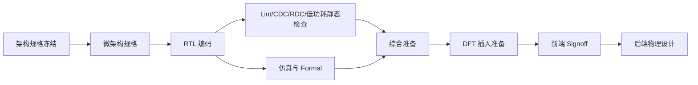

# 02_frontend_design_and_verification：前端设计与验证

## 前置知识

- 建议先读 [完整芯片生命周期总览](../00_overview/01_full_lifecycle.md)。
- 建议先读 [角色和团队职责](../00_overview/02_roles_and_teams.md)。
- 建议先读 [产品定义与架构](../01_product_definition_and_architecture/README.md)。
- 如果你用 C/C++ 做架构模型，先读术语表中的 [C Model](../00_overview/05_glossary.md#c-model)、[RTL](../00_overview/05_glossary.md#rtl)、[Microarchitecture](../00_overview/05_glossary.md#microarchitecture)。

## 本目录的作用

本目录讲从架构规格进入可综合硬件实现的阶段：微架构设计、RTL 编码、前端验证、综合准备、DFT 引入、CDC/RDC、低功耗设计和前端签核。

对软件背景创始人来说，这一阶段最容易产生两个误判。第一个误判是“C model 正确，所以 RTL 只是翻译”。实际上 [C Model](../00_overview/05_glossary.md#c-model) 通常描述算法和功能，而 [RTL](../00_overview/05_glossary.md#rtl) 描述寄存器、组合逻辑、时钟、复位、握手、资源冲突和物理可实现结构。第二个误判是“agent 生成 RTL 可以省掉 RTL 工程能力”。agent 可以提高草稿速度、生成样板代码、补全接口和测试，但不能自动保证时序闭合、复位一致性、CDC 安全、综合语义、DFT 可插入性和验证充分性。

前端阶段的核心不是“写出能仿真的 Verilog”，而是建立一套可评审、可验证、可综合、可交给后端实现的工程资产。

## 文件索引

- [01_rtl_design_practices.md](./01_rtl_design_practices.md)：RTL 设计工程实践，重点解释 reset、锁存器、FSM、时序思维和 agent 生成 RTL 风险。
- [02_microarchitecture_design.md](./02_microarchitecture_design.md)：从架构规格到 pipeline、buffer、arbiter、NoC 接口、寄存器模型的细化过程。
- [03_verification_methodology.md](./03_verification_methodology.md)：仿真、UVM、formal、emulation、coverage、scoreboard 和 golden model 的组合方法。
- [04_synthesis_preparation.md](./04_synthesis_preparation.md)：如何让 RTL 进入综合，包括约束、库、层次、early synthesis 和 LEC 准备。
- [05_dft_introduction.md](./05_dft_introduction.md)：DFT 的目的、scan、MBIST、JTAG、ATPG、测试模式和早期设计约束。
- [06_cdc_and_rdc.md](./06_cdc_and_rdc.md)：时钟域和复位域跨越问题，为什么仿真通过不代表硅上安全。
- [07_low_power_design.md](./07_low_power_design.md)：clock gating、power gating、UPF、DVFS、低功耗验证和软件接口。
- [08_signoff_criteria.md](./08_signoff_criteria.md)：前端签核标准、证据包、风险登记和进入后端的条件。
- [09_software_engineer_pitfalls.md](./09_software_engineer_pitfalls.md)：软件背景人在前端最常见的思维和工程陷阱。

## 前端主流程

现实项目不是完全线性的。微架构会因验证发现的问题修改，RTL 会因综合结果调整，DFT 会反推 reset 和 scan 结构，后端 early floorplan 会反推 pipeline 切分和 memory macro 选择。先进节点下，这些反馈更早发生，因为线延迟、拥塞、功耗密度和 macro 位置会明显影响 RTL 结构。

## 关键交付物

| 交付物 | 主要 owner | 下游使用者 | 失败后果 |
|---|---|---|---|
| 微架构规格 | 架构/RTL | RTL、验证、软件、后端 | RTL 行为无法评审，验证无目标 |
| RTL 代码 | RTL designer | 验证、综合、DFT、后端 | 仿真或综合失败，功能风险进入硅 |
| Verification plan | 验证负责人 | DV、架构、软件 | 覆盖率无意义，bug 漏到后期 |
| Assertion/coverage | DV/RTL | DV、formal、signoff | corner case 无证据 |
| Lint/CDC/RDC 报告 | RTL/DV | signoff、后端 | 静态结构风险进入后端 |
| SDC 初版 | RTL/综合/后端 | 综合、STA | timing 结果失真 |
| DFT 约束 | DFT/RTL | 综合、测试、后端 | scan/MBIST 后期插不进去 |
| 前端 signoff 包 | 项目负责人 | 后端、公司管理层 | 进入后端时风险不可见 |

## 角色分工

前端阶段至少需要 RTL designer、design verification engineer、system architect、synthesis/implementation engineer、DFT engineer、low-power engineer、firmware/software engineer 和项目负责人。创业公司早期可以一人兼多职，但不能让一个只懂 C model 的人独自承担 RTL、验证、综合、DFT 和 CDC 全部责任。

对 AI 芯片，编译器和 runtime 团队必须早参与。很多前端 bug 不是乘法器算错，而是任务调度、DMA、buffer 生命周期、cache coherency、interrupt、异常处理和性能计数器行为没定义清楚。

## 创业公司视角

可以加速的部分包括：架构模型迭代、可复用 RTL 模板、寄存器生成、接口 glue logic、仿真回归自动化、lint/CDC 自动检查、文档一致性检查、test generation 和 coverage dashboard。

不能轻易压缩的部分包括：微架构评审、reset/clock/power 策略、CDC/RDC signoff、验证计划收敛、DFT 架构、timing 约束审查、关键 IP 集成验证。压缩这些环节往往不是节省时间，而是把 bug 推迟到后端或硅后。

第一颗芯片建议少做“聪明硬件”，多做“可验证硬件”。复杂 out-of-order 调度、动态数据流、宽松一致性模型、过度参数化 RTL 和多时钟多电源域会显著增加验证和签核成本。

## 典型场景

一个团队用 C++ 架构模型探索出 256 TOPS 的 NPU 数据流，并让 agent 生成 Verilog。初始仿真能跑通几个 matmul case。进入工程化后，验证工程师发现 C model 没定义 backpressure 时 partial sum buffer 的行为；RTL 在 ready/valid 同时变化时丢事务；reset 后性能计数器有 X 值；DMA 和 compute tile 跨时钟域没有同步；综合后关键路径在地址比较和仲裁器上爆掉；DFT 工程师要求某些异步 reset 和 gated clock 重构。

正确处理方式不是继续让 agent “修到仿真过”，而是回到微架构规格：定义事务协议、时钟域边界、buffer 满空语义、reset 状态、异常行为、性能计数器可见性、DFT/test mode 要求和综合约束。agent 可以生成候选 RTL，但每次修改必须通过 lint、单元测试、assertion、formal 或 directed/random regression，并由 RTL owner 评审。

## 后续阅读

- [RTL 设计工程实践](./01_rtl_design_practices.md)
- [微架构设计](./02_microarchitecture_design.md)
- [前端验证方法学](./03_verification_methodology.md)
- [前端签核标准](./08_signoff_criteria.md)
- [软件背景人的前端陷阱](./09_software_engineer_pitfalls.md)

## 参考公开来源

- [IEEE 1800-2023 SystemVerilog 标准页面](https://standards.ieee.org/standard/1800-2023.html)
- [IEEE 1800.2-2020 UVM 标准页面](https://standards.ieee.org/ieee/1800.2/7567/)
- [Accellera Standards](https://accellera.com/downloads/standards)
- [Synopsys VCS](https://www.synopsys.com/verification/simulation/vcs.html)
- [Cadence Xcelium](https://www.cadence.com/en_US/home/tools/system-design-and-verification/simulation-and-testbench-verification/xcelium-simulator.html)
- [Verilator](https://github.com/verilator/verilator)

## 内容可信度说明

- **公开信息（高可信）**：SystemVerilog、UVM、UPF、PSS 等标准存在公开规范；VCS、Xcelium、Verilator、Design Compiler、Genus、SpyGlass、Questa、PrimeTime 等工具类别和用途可由公开页面确认。
- **行业惯例（中可信）**：前端阶段需要微架构规格、RTL、验证计划、coverage、lint、CDC/RDC、DFT 准备、综合约束和 signoff 包；这些交付物的具体模板因公司而异。
- **经验性观察（中低可信）**：创业公司应优先控制验证边界，避免第一颗芯片引入过多动态硬件机制；agent 生成 RTL 的主要风险集中在未定义行为、综合语义和跨域结构。
- **不确定/需向资深工程师确认（低可信）**：不同先进节点、不同 foundry、不同 IP vendor 对前端 signoff 的具体清单、waiver 标准和工具版本要求。
