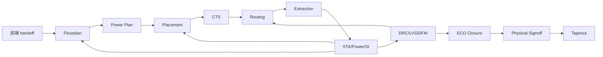

# 03_backend_physical_design：后端物理设计

## 前置知识

- 建议先读 [完整芯片生命周期总览](../00_overview/01_full_lifecycle.md)。
- 建议先读 [前端签核标准](../02_frontend_design_and_verification/08_signoff_criteria.md)。
- 建议理解 [Netlist](../00_overview/05_glossary.md#netlist)、[SDC](../00_overview/05_glossary.md#sdc)、[STA](../00_overview/05_glossary.md#sta)、[Floorplan](../00_overview/05_glossary.md#floorplan)、[Placement](../00_overview/05_glossary.md#placement)、[CTS](../00_overview/05_glossary.md#cts)、[Routing](../00_overview/05_glossary.md#routing)、[DRC](../00_overview/05_glossary.md#drc)、[LVS](../00_overview/05_glossary.md#lvs)。

## 本目录的作用

后端物理设计把前端交付的 RTL/网表、约束、库文件、IP 物理视图和工艺规则，变成可以交给 foundry 制造的 GDSII/OASIS。它不是“自动布局布线”，而是围绕 [PPA](../00_overview/05_glossary.md#ppa)、可制造性、时序、电源完整性和风险收敛的工程过程。

对软件背景创始人来说，后端最重要的认知转换是：物理世界会反过来定义设计边界。一个在 C model 和 RTL 中看起来合理的结构，可能因为线长、拥塞、时钟树、IR drop、macro 位置、pin access 或 DRC 规则而不可实现，或者实现成本极高。先进节点 7nm 及以下尤其如此，因为线延迟、寄生参数、工艺变异、功耗密度和设计规则复杂度都显著提高。

## 后端主流程

实际流程高度迭代。placement 发现拥塞会反推 floorplan；STA 发现关键路径会反推 RTL pipeline；IR drop 发现热点会反推 power grid 和 activity；DRC 发现 pin access 问题会反推 cell choice 或 macro channel；ECO 修时序可能引入新的 hold violation 或 DRC。

## 文件索引

- [01_floorplanning.md](./01_floorplanning.md)：die/block 尺寸、macro、IO、电源网格和物理分区。
- [02_placement.md](./02_placement.md)：标准单元布局、拥塞、时序驱动优化和 early PPA。
- [03_clock_tree_synthesis.md](./03_clock_tree_synthesis.md)：时钟树、skew、latency、clock power、OCV 和 useful skew。
- [04_routing.md](./04_routing.md)：global/detail route、寄生、SI、DRC、pin access 和 routing closure。
- [05_static_timing_analysis.md](./05_static_timing_analysis.md)：STA、corner/mode、setup/hold、OCV/AOCV/POCV、ECO。
- [06_power_analysis.md](./06_power_analysis.md)：功耗估算、IR drop、EM、热、activity 和电源完整性。
- [07_drc_lvs_signoff.md](./07_drc_lvs_signoff.md)：DRC、LVS、antenna、density、fill、physical signoff。
- [08_advanced_node_considerations.md](./08_advanced_node_considerations.md)：7nm 及以下节点的特殊约束。
- [09_backend_outsourcing.md](./09_backend_outsourcing.md)：后端外包边界、交付物、验收和创业公司取舍。

## 关键输入与输出

后端输入包括综合网表、SDC、[UPF](../00_overview/05_glossary.md#upf)/CPF、[LEF/DEF](../00_overview/05_glossary.md#lefdef)、[Liberty](../00_overview/05_glossary.md#liberty) timing/power library、[RC tech file](../00_overview/05_glossary.md#rc-tech-file)、PDK、standard cell library、SRAM/PLL/SerDes/IO 等 IP 物理视图、DFT 信息、clock/reset/power intent、floorplan 约束和前端风险清单。

后端输出包括 DEF/GDSII/[OASIS](../00_overview/05_glossary.md#oasis)、寄生 [SPEF](../00_overview/05_glossary.md#spef)、timing signoff 报告、power/IR/EM 报告、DRC/LVS/antenna/density/fill 报告、ECO 记录、waiver 清单、tapeout package 和 physical signoff 证据包。

## 工具名

常见实现工具包括 Synopsys IC Compiler II/Fusion Compiler、Cadence Innovus、Siemens Aprisa。常见时序签核工具包括 Synopsys PrimeTime、Cadence Tempus。寄生抽取包括 Synopsys StarRC、Cadence Quantus。物理验证包括 Siemens Calibre nmDRC/nmLVS、Synopsys IC Validator、Cadence Pegasus。功耗和电源完整性包括 Cadence Voltus、Ansys RedHawk-SC、Synopsys PrimePower/Fusion Power。

工具选择通常由 foundry reference flow、公司历史脚本、IP vendor 支持、license 成本和团队经验决定。创业公司不要轻易自创“独特后端 flow”，除非有非常强的后端负责人和 foundry/EDA 支持。

## 关键决策点

- 目标频率与节点：更高频率会增加 STA、CTS、routing、IR/EM 和 ECO 压力，不一定比通过并行度提升吞吐更划算。
- 面积利用率与 margin：提高 utilization 可以降低 die size，但会增加拥塞和 signoff 风险。
- Macro 和 IO 位置：SRAM、PHY、HBM/DDR、SerDes、bump/pad 的位置会决定数据流、封装和电源网络。
- 外包范围：可以外包执行，但不能外包 PPA 目标、约束判断、waiver 接受和 tapeout 风险决策。
- 何时回前端：当后端发现结构性长线、集中控制、过宽总线、不可收敛时，应回到 RTL/微架构，而不是继续用工具参数硬扛。

## 常见坑

- 把后端当作“RTL 到 GDSII 的编译器”，低估 floorplan、约束、IP 视图和 signoff 的人工作业。
- 前端 SDC、UPF、DFT、CDC waiver 不干净，却强行进入后端。
- 只看 [WNS/TNS](../00_overview/05_glossary.md#wnstns)，不看拥塞、IR drop、SI、DRC、LVS、waiver 和可复现性。
- 等到 post-route 或 tapeout 前才引入 signoff deck、IR/EM、full-chip DRC/LVS。
- 外包后端但内部没有人能审查 floorplan、timing exception、power scenario 和 waiver。

## 成本视角

后端成本通常由 EDA license、工程人力、计算资源、设计服务、IP 物理视图支持和迭代时间组成。成熟节点小 block 的外包/实现成本可能是数万美元到数十万美元量级；复杂 SoC 或先进节点后端服务可能进入数十万到数百万美元量级，具体取决于节点、面积、corner/mode 数、IP 数量和 signoff 范围。先进节点 full mask/respin 风险通常是百万到千万美元量级，远高于多做几轮 early floorplan、STA 和 trial route 的成本。

## 典型时长与角色

小型 test chip 或成熟节点 block 后端可能是数周到数月量级；复杂 SoC、AI 加速器或 7nm 及以下全芯片后端通常是数月量级，并且需要多轮 closure。不要把“工具跑一遍”误解为“后端完成”。真正耗时的是时序、电源、拥塞、DRC、ECO 和 signoff 之间的收敛。

核心角色包括 physical design engineer、STA engineer、power integrity engineer、DFT engineer、package/IO engineer、CAD/flow engineer、IP integration engineer、foundry/EDA AE、项目负责人。创业公司可以外包部分执行，但必须内部保留能判断 PPA、signoff 风险和外包质量的人。

## 典型场景

一个 AI 芯片前端团队交付了功能正确的 NPU tile，目标频率很激进。后端早期 floorplan 后发现 SRAM macro 环绕 compute array，数据路径线长超过预期；placement 后拥塞集中在 NoC 入口；CTS 后 clock power 超预算；STA 显示跨 tile reduction tree 是关键路径；IR 分析显示某些 workload 下局部电压下降过大。正确做法不是只让后端“努力优化”，而是前端、架构、软件、后端一起决定：是否增加 pipeline、调整 tile 形状、改变 SRAM banking、降低目标频率、拆分 clock domain、改变 workload 调度或接受面积增加。

## 创业公司取舍

创业公司可以节省的地方是：选择成熟 reference flow、复用标准 IP、减少不必要的电源域、限制首版频率目标、用 MPW 或较成熟节点验证关键架构、把非核心 hard IP 和部分后端执行外包。

不能省的是：约束审查、floorplan review、STA signoff、IR/EM signoff、DRC/LVS clean、ECO 变更控制、foundry rule deck 版本管理、tapeout checklist。后端错误通常不能靠软件补丁修复，越接近 tapeout，修复成本越高。

## 后续阅读

- [Floorplanning](./01_floorplanning.md)
- [Placement](./02_placement.md)
- [静态时序分析](./05_static_timing_analysis.md)
- [先进节点特殊考虑](./08_advanced_node_considerations.md)
- [后端外包决策](./09_backend_outsourcing.md)

## 参考公开来源

- [Synopsys IC Compiler II](https://www.synopsys.com/implementation-and-signoff/physical-implementation/ic-compiler.html)
- [Cadence Innovus Implementation System](https://www.cadence.com/en_US/home/resources/datasheets/innovus-implementation-system-ds.html)
- [Synopsys PrimeTime](https://www.synopsys.com/implementation-and-signoff/signoff/primetime.html)
- [Cadence Voltus](https://www.cadence.com/en_US/home/resources/datasheets/voltus-ic-power-integrity-solution-gt-ds.html)
- [Siemens Calibre nmDRC](https://www.siemens.com/en-us/products/ic/calibre-design/physical-verification/design-rule-checking/)

## 内容可信度说明

- **公开信息（高可信）**：后端流程、STA、DRC/LVS、IR/EM、主要 EDA 工具类别和用途可由公开 EDA 文档确认。
- **行业惯例（中可信）**：后端输入输出、PPA closure、ECO、waiver、signoff package 是主流 ASIC 项目惯例，但模板因公司而异。
- **经验性观察（中低可信）**：创业公司应保留内部后端判断能力，避免把 signoff 判断完全外包。
- **不确定/需向资深工程师确认（低可信）**：具体节点的 signoff deck、corner 数量、IR/EM 阈值、foundry tapeout checklist 和工具版本要求。
