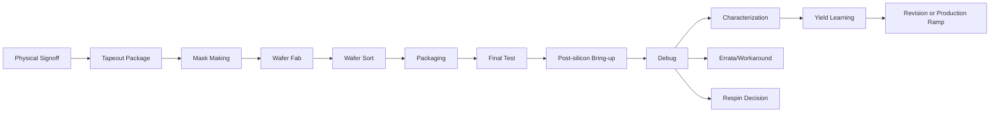

# 04_tapeout_and_post_silicon：流片与硅后

## 前置知识

- 建议先读 [后端物理设计总览](../03_backend_physical_design/README.md)。
- 建议先读 [DRC/LVS Signoff](../03_backend_physical_design/07_drc_lvs_signoff.md)。
- 建议理解 [流片 Tapeout](../00_overview/05_glossary.md#流片-tapeout)、[GDSII](../00_overview/05_glossary.md#gdsii)、[OASIS](../00_overview/05_glossary.md#oasis)、[Mask Cost](../00_overview/05_glossary.md#mask-cost)、[Wafer](../00_overview/05_glossary.md#wafer)、[Package](../00_overview/05_glossary.md#package)、[Bring-up](../00_overview/05_glossary.md#bring-up)、[Yield](../00_overview/05_glossary.md#yield)、[Respin](../00_overview/05_glossary.md#respin)。

## 本目录的作用

本目录覆盖从 tapeout 决策到 mask、晶圆制造、封装、首硅 bring-up、硅后 debug、characterization、良率分析和 silicon revision 的完整链路。前端和后端把“设计”推进到物理签核，本目录讲的是如何把它变成可测、可调、可量产的产品。

对软件背景创始人，最重要的认知转换是：tapeout 不是项目结束，而是高成本反馈周期的开始。GDS 交出去之后，很多问题不再能靠改代码、重新编译、发版解决。mask、wafer fab、封装、测试、可靠性和客户验证都有物理周期和供应链约束。

## 主流程

这条链路不是单向成功路径。bring-up 失败可能回到 board/package/power/clock/RTL 假设；characterization 结果可能反向修改 datasheet；yield 分析可能要求 DFT、test program、封装或版图修正；严重 bug 可能触发 metal ECO 或 full respin。

## 文件索引

- [01_tapeout_process.md](./01_tapeout_process.md)：tapeout package、签核会议、waiver、ECO 和交付门禁。
- [02_mask_making_and_wafer_fab.md](./02_mask_making_and_wafer_fab.md)：mask set、光刻、晶圆制造、MPW 与 dedicated wafer。
- [03_packaging.md](./03_packaging.md)：封装、供电、散热、SI/PI、OSAT 和 AI 芯片封装取舍。
- [04_post_silicon_bringup.md](./04_post_silicon_bringup.md)：首硅上电、时钟、复位、JTAG、boot 和最小功能闭环。
- [05_post_silicon_debug.md](./05_post_silicon_debug.md)：硅后 bug 定位、可观测性、workaround、errata 和 triage。
- [06_characterization.md](./06_characterization.md)：PVT、shmoo、功耗、性能、datasheet 和 binning。
- [07_yield_analysis.md](./07_yield_analysis.md)：wafer sort、final test、fail bin、scan diagnosis 和良率学习。
- [08_silicon_revision.md](./08_silicon_revision.md)：metal ECO、base-layer ECO、full respin、版本管理和创业预算。

## 角色和接口

本阶段角色跨越芯片设计团队和供应链：后端/physical signoff、DFT、ATE/test、firmware、driver、board、package、SI/PI、thermal、foundry、OSAT、failure analysis、product、FAE、客户支持。创业公司常低估这一阶段的人力密度，因为 tapeout 后很多问题需要硬件、软件、测试、封装和制造同时协作。

上游输入是 signoff-ready layout、waiver、test collateral、DFT/ATPG、封装设计、board/EVB、bring-up plan 和软件栈。下游输出是首硅状态、errata、characterization data、yield report、量产测试程序、datasheet、revision plan 或 production ramp 决策。

## 典型周期和成本

Tapeout package 准备和最终检查通常是天到数周量级；mask 制作和 wafer fab 通常是数周到数月量级；封装和测试开发通常也是数周到数月量级，先进封装或 HBM 项目可能更长。首硅 bring-up 可能从几天到数月不等，取决于设计质量、debug hooks、软件准备和问题严重性。

成本上，成熟节点 MPW 可以把试验成本降到数万到数十万美元量级；先进节点 full mask 通常是数百万到千万美元量级，wafer、封装、测试、板卡、实验室设备和工程人力还要另算。先进封装、HBM、大 die、复杂 ATE 程序会显著提高 NRE 和单位成本。

## 关键决策点

- Tapeout go/no-go：是否还有未关闭 waiver、未验证 ECO、未准备好的 DFT/test/bring-up 项。
- MPW vs dedicated wafer：MPW 降低原型成本，但面积、封装、时间窗口和样品量受限；dedicated wafer 更接近量产但 NRE 高。
- 封装策略：成熟封装降低首版风险，HBM/2.5D/先进封装提高性能但放大供应链、良率和调试难度。
- Bring-up readiness：样片到货前 EVB、firmware、JTAG、ATE pattern、实验室设备是否 ready。
- Respin decision：bug 能否 workaround，是否影响数据正确性、客户承诺、量产良率和可靠性。

## 常见坑

- 把 tapeout 当项目结束，样片回来后才开始准备固件、板卡和测试程序。
- 为了赶时间带着不清楚的 waiver 流片，硅后无法判断是设计、封装、测试还是工艺问题。
- 只看首硅 demo 成功，不看 characterization、yield、ATE test time 和客户 qualification。
- 没有预留 respin 预算和 schedule buffer，把公司计划建立在“一次成功”假设上。
- 混淆 lab demo、engineering sample、qualified product 和 volume production。

## 创业公司视角

可以加速的是 tapeout checklist 自动化、版本一致性检查、test pattern 管理、bring-up 脚本、实验数据采集、bug triage dashboard、characterization 自动化。不能随意压缩的是 mask、fab、封装、可靠性、失效分析和客户验证。

第一颗芯片要提前设计可观测性和可控性：JTAG、scan、MBIST、trace buffer、性能计数器、错误寄存器、boot strap、safe mode、clock/power controls。没有这些结构，硅后 debug 会变成猜测。

## 后续阅读

- [Tapeout 流程](./01_tapeout_process.md)
- [Mask 制作与晶圆制造](./02_mask_making_and_wafer_fab.md)
- [硅后 Bring-up](./04_post_silicon_bringup.md)
- [Silicon Revision](./08_silicon_revision.md)

## 参考公开来源

- [Siemens Calibre nmDRC](https://www.siemens.com/en-us/products/ic/calibre-design/physical-verification/design-rule-checking/)
- [Synopsys IC Validator](https://www.synopsys.com/icvalidator)
- [JEDEC JESD47 overview via TI reliability testing reference](https://www.ti.com/quality-reliability/reliability/testing.html)
- [TSMC Open Innovation Platform overview](https://www.tsmc.com/english/dedicatedFoundry/oip)

## 内容可信度说明

- **公开信息（高可信）**：tapeout、GDS/OASIS、mask、wafer、OSAT、ATE、bring-up、characterization、yield、respin 的基本定义和流程。
- **行业惯例（中可信）**：tapeout checklist、bring-up 顺序、硅后 debug、yield learning 和 revision 决策流程。
- **经验性观察（中低可信）**：创业公司应把首硅视为高成本反馈起点，并提前投入 debug/DFT/test 基础设施。
- **不确定/需向资深工程师确认（低可信）**：具体 foundry checklist、mask/fab 周期、封装产能、ATE 成本、reliability 要求和客户接受标准。
