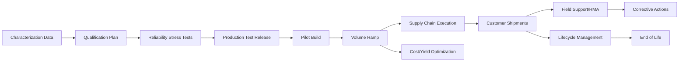

# 05_production_and_lifecycle：量产与生命周期

## 前置知识

- 建议先读 [流片与硅后总览](../04_tapeout_and_post_silicon/README.md)。
- 建议先读 [Characterization](../04_tapeout_and_post_silicon/06_characterization.md) 和 [Yield Analysis](../04_tapeout_and_post_silicon/07_yield_analysis.md)。
- 建议理解 [Qualification](../00_overview/05_glossary.md#qualification)、[Reliability](../00_overview/05_glossary.md#reliability)、[Volume Ramp](../00_overview/05_glossary.md#volume-ramp)、[ATE](../00_overview/05_glossary.md#ate)、[OSAT](../00_overview/05_glossary.md#osat)、[RMA](../00_overview/05_glossary.md#rma)、[EOL](../00_overview/05_glossary.md#eol)。

## 本目录的作用

本目录覆盖芯片从 engineering sample 走向可销售产品、量产爬坡、客户现场支持和生命周期退出的流程。前一个目录回答“硅片能不能工作、为什么不工作、是否需要改版”，本目录回答“它能不能稳定、大规模、可预测、可支持地交付给客户”。

软件背景创始人容易把“首硅 demo 跑通”当成产品完成。芯片公司真正进入商业交付时，核心问题变成可靠性认证、测试覆盖、良率爬坡、供应链承诺、客户质量协议、现场问题闭环和版本追溯。这些工作不一定像架构和 RTL 那样有技术炫耀点，但直接决定毛利、现金流和客户信任。

## 主流程

量产不是一次性事件，而是一组受控放量决策。每次增加 wafer start、封装产能、ATE 机台、库存和客户出货承诺，都应该有数据支撑：良率趋势、测试 fail bin、可靠性结果、客户 qualification 状态、供应商交期、质量逃逸风险和现金占用。

## 文件索引

- [01_qualification_and_reliability.md](./01_qualification_and_reliability.md)：可靠性认证、JEDEC/AEC 思路、stress test、requalification 和质量门禁。
- [02_volume_ramp.md](./02_volume_ramp.md)：pilot build、yield ramp、test time、binning、产能爬坡和毛利影响。
- [03_supply_chain.md](./03_supply_chain.md)：foundry、OSAT、ATE、基板、封装材料、库存、追溯和供应风险。
- [04_field_support.md](./04_field_support.md)：客户现场问题、FAE、RMA、failure analysis、errata 和质量闭环。
- [05_end_of_life.md](./05_end_of_life.md)：产品生命周期、last time buy、替代料、长期支持和退出策略。

## 阶段接口

上游输入来自 [硅后 characterization](../04_tapeout_and_post_silicon/06_characterization.md)、[良率分析](../04_tapeout_and_post_silicon/07_yield_analysis.md)、ATE test program、datasheet、errata、封装规格、BOM 和客户需求。下游输出包括 qualified product、production test limit、CP/FT 数据、质量报告、客户 PCN、RMA 闭环、供应计划和 EOL 通知。

这个阶段的接口最容易出问题，因为它跨工程、销售、运营、财务和法务。比如架构团队想继续调 PPA，客户团队想承诺交期，运营团队关心 wafer start，财务关心库存和现金，质量团队关心可靠性证据。如果没有统一 release gate，创业公司会在“还没真正 ready”时把产品推给客户。

## 典型角色

核心角色包括 product engineering、test engineering、quality/reliability、operations、supply chain、foundry interface、OSAT interface、FAE、firmware/driver、failure analysis、program manager、finance 和 sales operations。创业早期不一定每个岗位都有专人，但职责不能消失。

对 AI 芯片公司，还需要把编译器和系统软件团队纳入量产流程。客户现场的失败可能不是硅 bug，而是模型转换、runtime、driver、firmware、PCIe、散热、服务器兼容性或功耗策略问题。现场支持不能只由硬件工程师承担。

## 关键决策点

- 何时从 engineering sample 转为 production release：依据不是 demo，而是 qualification、test coverage、yield、datasheet、errata 和客户验收。
- 是否扩大 wafer start：依据是良率趋势、需求确定性、现金承受能力和供应链 lead time。
- 是否开放更多客户试用：依据是现场支持能力、已知限制、debug 工具和软件成熟度。
- 是否修版或用 workaround 出货：依据是 bug 严重性、客户场景、法律风险、质量逃逸和长期支持成本。
- 何时 EOL：依据是需求衰减、供应风险、工艺/封装停产、替代产品和维护成本。

## 常见坑

- 只看芯片功能，不看 ATE test time、封装良率、库存周转和售后质量成本。
- 用实验室条件下的板卡 demo 代替客户系统级 qualification。
- 没有 lot/date code/wafer map 追溯，现场问题无法定位到批次。
- 为了收入提前量产，结果 bug 或可靠性问题进入客户现场，后续 RMA 和信誉损失远高于提前出货收益。
- 忽视软件版本管理，客户拿到的 driver、firmware、compiler 与硅片 revision 不匹配。

## 创业公司视角

创业公司可以把 reliability lab、部分 failure analysis、封装量产、ATE 产能、物流和库存执行外包，但不能外包质量决策、客户承诺、版本定义、供应链风险判断和 field issue triage。原因很简单：外包方只对合同范围负责，不替你承担产品口碑和现金流风险。

快速迭代在量产阶段的真实边界更硬。你可以自动化 CP/FT 数据分析、RMA triage、客户日志采集、良率 dashboard、供应链 forecast，但不能跳过可靠性 stress、客户 qualification、物料 lead time 和质量变更通知。

## 后续阅读

- [可靠性认证](./01_qualification_and_reliability.md)
- [量产爬坡](./02_volume_ramp.md)
- [供应链](./03_supply_chain.md)
- [现场支持](./04_field_support.md)
- [生命周期退出](./05_end_of_life.md)

## 参考公开来源

- [JEDEC JESD47 standard page](https://www.jedec.org/standards-documents/docs/jesd47)
- [AEC-Q100 overview by Renesas](https://www.renesas.com/en/products/automotive-products/aec-q100)
- [SEMI T26 supply-chain traceability description](https://store-us.semi.org/products/t02600-semi-t26-specification-for-electronic-supply-chain-traceability-using-distributed-ledger-technology-3)

## 内容可信度说明

- **公开信息（高可信）**：qualification、reliability、ATE、OSAT、RMA、EOL、lot traceability 的基本概念和行业标准方向。
- **行业惯例（中可信）**：从 ES 到 production release 的门禁、pilot build、volume ramp、field support 和 corrective action 流程。
- **经验性观察（中低可信）**：创业公司容易过早承诺客户交付，并低估现场支持、库存和质量成本。
- **不确定/需向资深工程师确认（低可信）**：具体客户 qualification 条款、foundry/OSAT 产能承诺、商业赔偿责任和各市场的法规要求。
