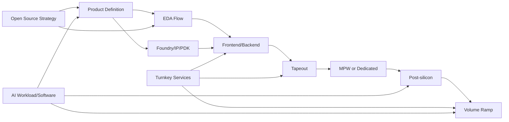

# 06_cross_cutting_topics：横向主题

## 前置知识

- 建议先读 [完整生命周期](../00_overview/01_full_lifecycle.md)。
- 建议先读 [成本结构](../00_overview/03_cost_structure.md)。
- 建议理解 [EDA](../00_overview/05_glossary.md#eda)、[Foundry](../00_overview/05_glossary.md#foundry)、[PDK](../00_overview/05_glossary.md#pdk)、[MPW](../00_overview/05_glossary.md#mpw-multi-project-wafer)、[Turnkey](../00_overview/05_glossary.md#turnkey)、[Open Source Silicon](../00_overview/05_glossary.md#open-source-silicon)。

## 本目录的作用

本目录讨论不属于单一阶段、但会影响全流程的主题：EDA 工具、foundry 关系、开源芯片、MPW、turnkey 服务和 AI 芯片特有约束。它们会同时影响产品定义、前端验证、后端、流片、量产和商业模式。

对你的背景，这个目录的核心价值是建立“哪些事情可以通过自动化和开源降低门槛，哪些事情仍然被商业 EDA、PDK、foundry、IP、封装、测试和客户质量体系强约束”的判断框架。快速迭代芯片公司不能只优化 RTL 生成速度，还要优化真实 tapeout 和量产反馈回路。

## 文件索引

- [01_eda_tools_landscape.md](./01_eda_tools_landscape.md)：商业 EDA、开源 EDA、工具链成本、flow ownership 和自动化边界。
- [02_foundry_relationships.md](./02_foundry_relationships.md)：foundry 关系、PDK 获取、工艺支持、产能、商务和 tapeout 接口。
- [03_open_source_silicon.md](./03_open_source_silicon.md)：开源 RTL、开源 EDA、开放 PDK、许可证、验证责任和开源商业策略。
- [04_mpw_shuttle_strategy.md](./04_mpw_shuttle_strategy.md)：MPW、shuttle、test chip、prototype、专用 mask 的选择。
- [05_turnkey_services.md](./05_turnkey_services.md)：设计服务、后端外包、turnkey 制造、外包治理和供应商选择。
- [06_ai_chip_specific.md](./06_ai_chip_specific.md)：AI 芯片的 workload、软件栈、HBM/NoC、功耗、封装和系统验证。

## 横向依赖图

## 角色、工具、周期和成本总览

横向主题通常没有单一 owner。EDA flow 由 CAD/flow、验证、后端、DFT 和 IT/license 共同维护；foundry 关系由 CEO/CTO、运营、法务、财务和技术负责人共同推进；开源策略需要工程、社区、法务和安全共同治理；MPW/test chip 需要小型但完整的前后端和硅后团队；turnkey 需要内部 technical owner 和项目经理；AI 芯片特有问题需要架构、编译器、runtime、系统验证和 FAE 同步决策。

周期上，这些主题都应在项目早期启动。EDA flow 和 foundry/IP 路径通常需要数周到数月建立，且贯穿全项目；开源治理和软件生态是持续投入；MPW 受 shuttle 窗口和制造周期约束，通常是数月级反馈；turnkey 供应商导入和合同谈判也常是数周到数月；AI workload/软件栈如果晚于 RTL 才启动，首硅窗口会被浪费。

成本上，商业 EDA、先进节点 mask/wafer、IP、封装、turnkey 服务和 AI 软件团队是主要 NRE 项。开源工具、MPW 和外包服务可以降低门槛或平滑现金流，但不能把 signoff、foundry、可靠性和客户支持成本消除。创业公司要把这些横向能力当成项目预算的一部分，而不是临时杂项。

## 关键决策点

- EDA 策略：商业全流程、开源辅助、还是混合 flow。先进节点通常离不开商业 signoff。
- Foundry 策略：直接 foundry 关系、通过设计服务/turnkey 进入，还是先用 MPW/开放 PDK 积累经验。
- 开源策略：开源 RTL/编译器到什么程度，哪些 IP、PDK、signoff collateral 不能开源。
- MPW 策略：用 MPW 验证 IP/小模块，还是直接做 full chip；MPW 不应被误认为量产路径。
- Turnkey 策略：外包后端/封装/测试执行，但保留架构、验证、质量和客户承诺 ownership。
- AI 芯片策略：先验证 workload 和软件生态，再承诺峰值算力和先进封装。

## 常见坑

- 把 OpenROAD/OpenLane 等开源 flow 的成功案例直接外推到 7nm full-chip signoff。
- 以为拿到 PDK 就等于有 foundry 支持；实际还需要 NDA、设计规则解释、IP、waiver、tapeout 流程和产能。
- 把开源 RTL 当作“免费 IP”，忽略许可证、验证、可综合性、DFT、CDC、后端和维护责任。
- 把 turnkey 当成风险转移；供应商可以交付服务，但不能替你承担产品定位和质量后果。
- AI 芯片只看 TOPS，不看 memory bandwidth、software stack、utilization、thermal、封装和客户 workload。

## 创业公司视角

创业公司应把横向主题当成“能力建设路线图”。第一阶段目标不是自建完整芯片公司所有能力，而是明确哪些能力必须内部掌握：产品/架构、验证标准、flow 意识、供应链决策、客户质量、软件栈。可以外包的是特定执行环节，不是判断力。

快速迭代的现实路径通常是：用 C model/模拟器/FPGA/小规模 MPW 缩短架构学习周期，用自动生成和验证基础设施缩短 RTL 迭代，用成熟节点或小 test chip 降低物理反馈成本；但 mask、fab、封装、可靠性和客户导入仍有硬周期。

## 后续阅读

- [EDA 工具版图](./01_eda_tools_landscape.md)
- [Foundry 关系](./02_foundry_relationships.md)
- [开源芯片策略](./03_open_source_silicon.md)
- [AI 芯片特有考虑](./06_ai_chip_specific.md)

## 参考公开来源

- [TSMC Open Innovation Platform](https://www.tsmc.com/english/dedicatedFoundry/oip)
- [OpenROAD GitHub repository](https://github.com/The-OpenROAD-Project/OpenROAD)
- [CHIPS Alliance about page](https://www.chipsalliance.org/about/who-we-are/)

## 内容可信度说明

- **公开信息（高可信）**：EDA、PDK、foundry、MPW、open-source silicon、turnkey、AI 芯片系统约束的基本概念。
- **行业惯例（中可信）**：商业 EDA/开源 EDA 混合、foundry 关系建立、turnkey 治理、MPW 使用边界。
- **经验性观察（中低可信）**：快速迭代芯片公司应把自动化重点放在反馈回路和证据管理，而不是只加速代码生成。
- **不确定/需向资深工程师确认（低可信）**：具体 foundry 准入、EDA 报价、turnkey 合同条款、先进封装产能和开源许可证法律解释。
