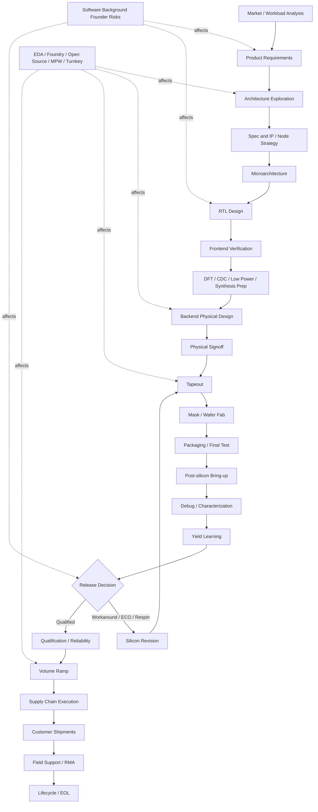

# 芯片开发流程 Wiki

## Wiki 目标

这份 Wiki 面向正在从系统软件和 AI 芯片建模转向芯片创业的创始人。目标不是把你训练成每个环节的专家，而是建立完整芯片开发流程的全局视野：知道从立项到量产每个阶段在做什么、谁负责、交付物是什么、关键决策在哪里、成本如何形成、哪些环节可以外包、哪些风险必须内部掌握。

主线覆盖从产品定义、架构探索、RTL/验证、后端物理设计、流片、硅后、量产、供应链到生命周期退出。横向主题覆盖 EDA、foundry、开源芯片、MPW、turnkey 和 AI 芯片特有约束。最后一个目录专门面向软件背景创始人，讨论常见误区、招聘优先级和快速迭代真实边界。

## 总流程图

## 推荐阅读顺序

如果你只按一个路径读，建议按下面顺序：

1. [00_overview/01_full_lifecycle.md](./00_overview/01_full_lifecycle.md)：先建立完整生命周期框架。
2. [00_overview/03_cost_structure.md](./00_overview/03_cost_structure.md)：理解 NRE、mask、IP、EDA、封测和量产成本。
3. [01_product_definition_and_architecture/README.md](./01_product_definition_and_architecture/README.md)：理解产品定义和架构阶段如何决定后续成本。
4. [02_frontend_design_and_verification/01_rtl_design_practices.md](./02_frontend_design_and_verification/01_rtl_design_practices.md)：重点读 RTL 与软件思维差异。
5. [02_frontend_design_and_verification/03_verification_methodology.md](./02_frontend_design_and_verification/03_verification_methodology.md)：理解验证为什么是芯片项目核心。
6. [03_backend_physical_design/README.md](./03_backend_physical_design/README.md)：建立后端流程和物理约束认知。
7. [04_tapeout_and_post_silicon/README.md](./04_tapeout_and_post_silicon/README.md)：理解 tapeout 不是结束，而是高成本反馈开始。
8. [05_production_and_lifecycle/README.md](./05_production_and_lifecycle/README.md)：理解量产、可靠性、供应链和现场支持。
9. [06_cross_cutting_topics/README.md](./06_cross_cutting_topics/README.md)：理解 EDA、foundry、开源、MPW、turnkey 的横向约束。
10. [07_for_software_background_founders/README.md](./07_for_software_background_founders/README.md)：最后把所有内容映射到软件背景创始人的行动策略。

## 重点阅读路径

如果你当前最关心“软件背景如何避免踩坑”，优先读：

- [02_frontend_design_and_verification/01_rtl_design_practices.md](./02_frontend_design_and_verification/01_rtl_design_practices.md)
- [02_frontend_design_and_verification/09_software_engineer_pitfalls.md](./02_frontend_design_and_verification/09_software_engineer_pitfalls.md)
- [07_for_software_background_founders/01_common_misconceptions.md](./07_for_software_background_founders/01_common_misconceptions.md)
- [07_for_software_background_founders/02_critical_mindset_shifts.md](./07_for_software_background_founders/02_critical_mindset_shifts.md)
- [07_for_software_background_founders/05_fast_iteration_realities.md](./07_for_software_background_founders/05_fast_iteration_realities.md)

如果你当前最关心“第一颗芯片怎么定范围”，优先读：

- [01_product_definition_and_architecture/01_market_and_workload_analysis.md](./01_product_definition_and_architecture/01_market_and_workload_analysis.md)
- [01_product_definition_and_architecture/03_architecture_exploration.md](./01_product_definition_and_architecture/03_architecture_exploration.md)
- [01_product_definition_and_architecture/04_ip_strategy.md](./01_product_definition_and_architecture/04_ip_strategy.md)
- [01_product_definition_and_architecture/05_process_node_selection.md](./01_product_definition_and_architecture/05_process_node_selection.md)
- [07_for_software_background_founders/04_first_chip_pragmatics.md](./07_for_software_background_founders/04_first_chip_pragmatics.md)

如果你当前最关心“快速迭代是否现实”，优先读：

- [06_cross_cutting_topics/01_eda_tools_landscape.md](./06_cross_cutting_topics/01_eda_tools_landscape.md)
- [06_cross_cutting_topics/03_open_source_silicon.md](./06_cross_cutting_topics/03_open_source_silicon.md)
- [06_cross_cutting_topics/04_mpw_shuttle_strategy.md](./06_cross_cutting_topics/04_mpw_shuttle_strategy.md)
- [06_cross_cutting_topics/05_turnkey_services.md](./06_cross_cutting_topics/05_turnkey_services.md)
- [07_for_software_background_founders/05_fast_iteration_realities.md](./07_for_software_background_founders/05_fast_iteration_realities.md)

## 完整文件索引

### 00_overview

- [README.md](./00_overview/README.md)：总览目录说明。
- [01_full_lifecycle.md](./00_overview/01_full_lifecycle.md)：完整芯片生命周期总览。
- [02_roles_and_teams.md](./00_overview/02_roles_and_teams.md)：各角色和团队职责。
- [03_cost_structure.md](./00_overview/03_cost_structure.md)：芯片项目成本结构。
- [04_startup_vs_bigcompany.md](./00_overview/04_startup_vs_bigcompany.md)：创业公司与大公司流程差异。
- [05_glossary.md](./00_overview/05_glossary.md)：全局术语表入口。

### 01_product_definition_and_architecture

- [README.md](./01_product_definition_and_architecture/README.md)：产品定义与架构目录说明。
- [01_market_and_workload_analysis.md](./01_product_definition_and_architecture/01_market_and_workload_analysis.md)：市场和 workload 分析。
- [02_spec_definition.md](./01_product_definition_and_architecture/02_spec_definition.md)：规格定义。
- [03_architecture_exploration.md](./01_product_definition_and_architecture/03_architecture_exploration.md)：架构探索。
- [04_ip_strategy.md](./01_product_definition_and_architecture/04_ip_strategy.md)：IP 自研 vs 购买策略。
- [05_process_node_selection.md](./01_product_definition_and_architecture/05_process_node_selection.md)：工艺节点选择。
- [06_milestones_and_signoffs.md](./01_product_definition_and_architecture/06_milestones_and_signoffs.md)：里程碑和签核。

### 02_frontend_design_and_verification

- [README.md](./02_frontend_design_and_verification/README.md)：前端设计与验证目录说明。
- [01_rtl_design_practices.md](./02_frontend_design_and_verification/01_rtl_design_practices.md)：RTL 设计工程实践。
- [02_microarchitecture_design.md](./02_frontend_design_and_verification/02_microarchitecture_design.md)：微架构设计。
- [03_verification_methodology.md](./02_frontend_design_and_verification/03_verification_methodology.md)：验证方法学。
- [04_synthesis_preparation.md](./02_frontend_design_and_verification/04_synthesis_preparation.md)：综合准备。
- [05_dft_introduction.md](./02_frontend_design_and_verification/05_dft_introduction.md)：DFT 引入。
- [06_cdc_and_rdc.md](./02_frontend_design_and_verification/06_cdc_and_rdc.md)：CDC/RDC。
- [07_low_power_design.md](./02_frontend_design_and_verification/07_low_power_design.md)：低功耗设计。
- [08_signoff_criteria.md](./02_frontend_design_and_verification/08_signoff_criteria.md)：前端签核标准。
- [09_software_engineer_pitfalls.md](./02_frontend_design_and_verification/09_software_engineer_pitfalls.md)：软件背景做 RTL 的坑。

### 03_backend_physical_design

- [README.md](./03_backend_physical_design/README.md)：后端物理设计目录说明。
- [01_floorplanning.md](./03_backend_physical_design/01_floorplanning.md)：Floorplanning。
- [02_placement.md](./03_backend_physical_design/02_placement.md)：Placement。
- [03_clock_tree_synthesis.md](./03_backend_physical_design/03_clock_tree_synthesis.md)：CTS。
- [04_routing.md](./03_backend_physical_design/04_routing.md)：Routing。
- [05_static_timing_analysis.md](./03_backend_physical_design/05_static_timing_analysis.md)：STA。
- [06_power_analysis.md](./03_backend_physical_design/06_power_analysis.md)：功耗分析。
- [07_drc_lvs_signoff.md](./03_backend_physical_design/07_drc_lvs_signoff.md)：DRC/LVS 签核。
- [08_advanced_node_considerations.md](./03_backend_physical_design/08_advanced_node_considerations.md)：先进节点特殊考虑。
- [09_backend_outsourcing.md](./03_backend_physical_design/09_backend_outsourcing.md)：后端外包决策。

### 04_tapeout_and_post_silicon

- [README.md](./04_tapeout_and_post_silicon/README.md)：流片与硅后目录说明。
- [01_tapeout_process.md](./04_tapeout_and_post_silicon/01_tapeout_process.md)：Tapeout 流程。
- [02_mask_making_and_wafer_fab.md](./04_tapeout_and_post_silicon/02_mask_making_and_wafer_fab.md)：Mask 与晶圆制造。
- [03_packaging.md](./04_tapeout_and_post_silicon/03_packaging.md)：封装。
- [04_post_silicon_bringup.md](./04_tapeout_and_post_silicon/04_post_silicon_bringup.md)：硅后 bring-up。
- [05_post_silicon_debug.md](./04_tapeout_and_post_silicon/05_post_silicon_debug.md)：硅后 debug。
- [06_characterization.md](./04_tapeout_and_post_silicon/06_characterization.md)：Characterization。
- [07_yield_analysis.md](./04_tapeout_and_post_silicon/07_yield_analysis.md)：良率分析。
- [08_silicon_revision.md](./04_tapeout_and_post_silicon/08_silicon_revision.md)：Silicon revision / respin。

### 05_production_and_lifecycle

- [README.md](./05_production_and_lifecycle/README.md)：量产与生命周期目录说明。
- [01_qualification_and_reliability.md](./05_production_and_lifecycle/01_qualification_and_reliability.md)：可靠性认证。
- [02_volume_ramp.md](./05_production_and_lifecycle/02_volume_ramp.md)：量产爬坡。
- [03_supply_chain.md](./05_production_and_lifecycle/03_supply_chain.md)：供应链。
- [04_field_support.md](./05_production_and_lifecycle/04_field_support.md)：现场支持。
- [05_end_of_life.md](./05_production_and_lifecycle/05_end_of_life.md)：生命周期退出。

### 06_cross_cutting_topics

- [README.md](./06_cross_cutting_topics/README.md)：横向主题目录说明。
- [01_eda_tools_landscape.md](./06_cross_cutting_topics/01_eda_tools_landscape.md)：EDA 工具版图。
- [02_foundry_relationships.md](./06_cross_cutting_topics/02_foundry_relationships.md)：Foundry 关系。
- [03_open_source_silicon.md](./06_cross_cutting_topics/03_open_source_silicon.md)：开源芯片策略。
- [04_mpw_shuttle_strategy.md](./06_cross_cutting_topics/04_mpw_shuttle_strategy.md)：MPW 策略。
- [05_turnkey_services.md](./06_cross_cutting_topics/05_turnkey_services.md)：Turnkey 服务。
- [06_ai_chip_specific.md](./06_cross_cutting_topics/06_ai_chip_specific.md)：AI 芯片特有考虑。

### 07_for_software_background_founders

- [README.md](./07_for_software_background_founders/README.md)：软件背景创始人目录说明。
- [01_common_misconceptions.md](./07_for_software_background_founders/01_common_misconceptions.md)：常见误区。
- [02_critical_mindset_shifts.md](./07_for_software_background_founders/02_critical_mindset_shifts.md)：关键思维转换。
- [03_recruitment_priorities.md](./07_for_software_background_founders/03_recruitment_priorities.md)：招聘优先级。
- [04_first_chip_pragmatics.md](./07_for_software_background_founders/04_first_chip_pragmatics.md)：第一颗芯片务实建议。
- [05_fast_iteration_realities.md](./07_for_software_background_founders/05_fast_iteration_realities.md)：快速迭代真实约束。

## 使用建议

每个文件结尾都有“内容可信度说明”。其中“公开信息（高可信）”通常可以作为沟通基础；“行业惯例（中可信）”适合用来设计流程，但要结合团队和供应商实际情况；“经验性观察（中低可信）”适合作为风险提醒；“不确定/需向资深工程师确认（低可信）”应在真实项目中向对应领域专家、foundry、IP vendor、OSAT、律师或客户确认。

这份 Wiki 的正确用法不是替代专家，而是让你更早知道该问谁、问什么、哪些承诺不能轻易做、哪些成本不能漏算。

## 内容可信度说明

- **公开信息（高可信）**：本 README 的目录索引、流程阶段名称和术语表入口来自本 Wiki 已生成文件。
- **行业惯例（中可信）**：推荐阅读顺序和流程图按典型 fabless ASIC/SoC 项目组织。
- **经验性观察（中低可信）**：重点阅读路径根据软件背景创始人的风险优先级排序。
- **不确定/需向资深工程师确认（低可信）**：真实项目中的阶段裁剪、并行方式和 gate 顺序需结合团队、节点、foundry、客户和资金情况确认。
